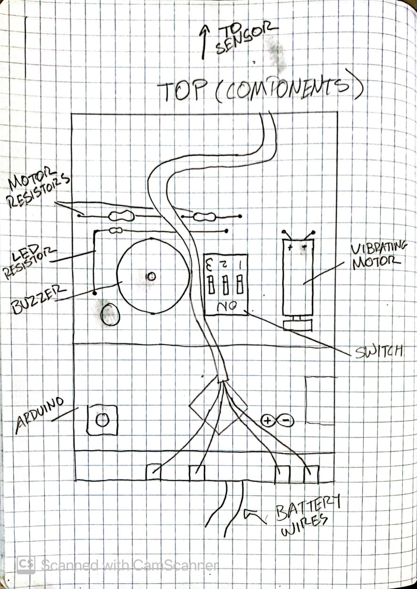

# Third Eye for the Blind
Hi, my name is Jack, and this project is a Third Eye for the Blind. This is an arduino based project that is intended to help visually-impaired people by giving them a wearable device tell them how close they are to an object. It uses a buzzer and vibrating motor to do so, and either can be turned off with the flip of a switch for the wearer's preference.

| **Engineer** | **School** | **Area of Interest** | **Grade** |
|:--:|:--:|:--:|:--:|
| Jack | Redwood High School | Mechanical/Aerospace Engineering | Rising Senior | 
    

# My Final Project
Here is two pictures of my final project, including the modifications. Below this I describe the steps I took to completing this project and the components that meake up this project. 

# Modifications (+ Demo of working project)
I made a few modifications after finishing this project, mostly related to making some casing for the electronics so they were less likely to be broken if they were hit. I first made casing out of cardboard, but then opted to build a new design out of legos for more durability. After some serious planning, I finished the casing for the perfboard and the sensor, and although it is a bit bulky, it serves its purpose as a good case. 

[![Modifications]
{:target="_blank" rel="noopener"}

# Final Milestone
My final milestone was to make everything I had built so far into a wearable device. For this, I needed to find something I could affix my tech to that was comfortable and practical. I first tested old fingerless biking gloves, but they were not long enough to include the battery pack, making the module bulky. I then modified an elbow sleeve to fit around my hand and wrist, which worked very well. All I had to do after that was glue the battery pack, perfboard, and sensor to the sleeve. To protect my hand from the spiky underside of the perfboard, I glued foam between the board and the glove, also providing stability. For the sensor, I did a similar thing, except I used cardboard. I also had to be precise with my placement, so that I could get wrist mobility without the board and battery pack hitting each other. I then cut the top of the elbow sleeve so that you could rest your fingers without disrupting the sensor, and glued everything on. After a few tweaks, this project was finally done.

.jpg)

.jpg)

[![Final Milestone]
{:target="_blank" rel="noopener"}

# Second Milestone
My second milestone was getting all of the components into on compact module. I did this by using a perfboard, on which I placed all of my electronics. I had to do some planning (final drawings shown below) to make the wiring simple, so there was as little interference as possible. This meant using resistors to go around some of the wiring to get all of the components connected. After planning came soldering, which went very well. I also had to find a different power source, as before I had just powered the Arduino with the computer, so I used a battery pack that fits 4 AA batteries. Though bulky, the batteries would last a long time, longer than a 9v, which was another option I had in mind. After soldering the battery pack in, my second milestone was done.

[![Second Milestone]
{:target="_blank" rel="noopener"}
# First Milestone
  
My first milestone was setting up all of the wiring and components through a breadboard and coding to make sure the components worked together. First I had to do a couple of tests to make sure all of the components worked before putting them all together. I ran the LED, vibrating motor, and buzzer through a circuit to make sure each of them worked. Then, I had to test the sensor. I researched a code from Arduino and uploaded it into my Arduino Micro, which is running this project, that told the sensor to print out the distance to an object in front of it, so I could make sure it was giving out accurate readings. After making sure all of the components worked, I wired them together and coded so that as the sensor got closer to something, the LED would blink faster, the vibrating motor would vibrate more often, and the buzzer buzzed more. I also implemented a switch system so that you could turn off the LED, buzzer, motor, or any combination of the three by breaking up that circuit, which makes it more customizable to the preference of the person wearing it. 

{:target="_blank" rel="noopener"}

[![First Milestone]
{:target="_blank" rel="noopener"}

# Bill of Materials
Soldering Iron + Solder
Hot glue gun

| **Part** | **AMT** | **Price** | **Link** |
|:--:|:--:|:--:|:--:|
| [Arduino Micro](https://store-usa.arduino.cc/collections/boards/products/arduino-micro) | 1 | $24.90 | https://store-usa.arduino.cc/collections/boards/products/arduino-micro | 
|:--:|:--:|:--:|:--:|
| [Red LED](https://www.digikey.com/en/products/detail/kingbright/WP7113ID/1747663?utm_adgroup=Optoelectronics&utm_source=google&utm_medium=cpc&utm_campaign=Shopping_Supplier_Kingbright_0754_Co-op&utm_term=&utm_content=Optoelectronics&gclid=Cj0KCQjw_7KXBhCoARIsAPdPTfirmhMYGFpurrasGfQAJDfrbpnGpv4lC40WOlxY_IlGINXmlCg) | 1 | $0.34 | https://www.digikey.com/en/products/detail/kingbright/WP7113ID/1747663?utm_adgroup=Optoelectronics&utm_source=google&utm_medium=cpc&utm_campaign=Shopping_Supplier_Kingbright_0754_Co-op&utm_term=&utm_content=Optoelectronics&gclid=Cj0KCQjw_7KXBhCoARIsAPdPTfirmhMYGFpurrasGfQAJDfrbpnGpv4lC40WOlxY_IlGINXmlCg
|:--:|:--:|:--:|:--:|
| [Vibrating Motor](https://www.amazon.com/tatoko-vibration-Waterproof-8000-16000RPM-toothbrush/dp/B07KYLZC1S/ref=asc_df_B07KYLZC1S/?tag=hyprod-20&linkCode=df0&hvadid=344005018279&hvpos=&hvnetw=g&hvrand=14784021389702076315&hvpone=&hvptwo=&hvqmt=&hvdev=c&hvdvcmdl=&hvlocint=&hvlocphy=9032091&hvtargid=pla-699509502233&psc=1&tag=&ref=&adgrpid=69357499415&hvpone=&hvptwo=&hvadid=344005018279&hvpos=&hvnetw=g&hvrand=14784021389702076315&hvqmt=&hvdev=c&hvdvcmdl=&hvlocint=&hvlocphy=9032091&hvtargid=pla-699509502233) | 1 | $2.14/motor | https://www.amazon.com/tatoko-vibration-Waterproof-8000-16000RPM-toothbrush/dp/B07KYLZC1S/ref=asc_df_B07KYLZC1S/?tag=hyprod-20&linkCode=df0&hvadid=344005018279&hvpos=&hvnetw=g&hvrand=14784021389702076315&hvpone=&hvptwo=&hvqmt=&hvdev=c&hvdvcmdl=&hvlocint=&hvlocphy=9032091&hvtargid=pla-699509502233&psc=1&tag=&ref=&adgrpid=69357499415&hvpone=&hvptwo=&hvadid=344005018279&hvpos=&hvnetw=g&hvrand=14784021389702076315&hvqmt=&hvdev=c&hvdvcmdl=&hvlocint=&hvlocphy=9032091&hvtargid=pla-699509502233 |
|:--:|:--:|:--:|:--:|
| [Buzzer]() | 1 | $0.96 | https://www.digikey.com/en/products/detail/myntahl-dba-east-electronics/TFM-51HA/13160471?utm_adgroup=MYNTAHL%20DBA%20EAST%20ELECTRONICS&utm_source=google&utm_medium=cpc&utm_campaign=Shopping_DK%2BSupplier_Tier%202%20-%20Block%201&utm_term=&utm_content=MYNTAHL%20DBA%20EAST%20ELECTRONICS&gclid=Cj0KCQjw_7KXBhCoARIsAPdPTfgFWRlGc-XsUlshEGinvEqzBsca2dx86gH7chdCVbbhf1xSHcSOA3gaAunnEALw_wcB | 
|:--:|:--:|:--:|:--:|
| [MtF Jumper Wires]() | 4 | $0.12/wire | https://www.bananarobotics.com/shop/Male-to-Female-Jumper-Wire-(25-pack)?gclid=Cj0KCQjw_7KXBhCoARIsAPdPTfgky23jCY39HCvjmSfB0QbPCW7cRL8UeMi1UGoXIlhjdBvOkTs-7tkaAkioEALw_wcB | 
|:--:|:--:|:--:|:--:|
| [AA Battery]() | 4 | $1.17/battery | https://www.amazon.com/AmazonBasics-Volt-Performance-Alkaline-Batteries/dp/B081FH11YT/ref=asc_df_B081FH11YT/?tag=hyprod-20&linkCode=df0&hvadid=416655650137&hvpos=&hvnetw=g&hvrand=6010098659420368039&hvpone=&hvptwo=&hvqmt=&hvdev=c&hvdvcmdl=&hvlocint=&hvlocphy=9032091&hvtargid=pla-907868416776&psc=1&tag=&ref=&adgrpid=94181909936&hvpone=&hvptwo=&hvadid=416655650137&hvpos=&hvnetw=g&hvrand=6010098659420368039&hvqmt=&hvdev=c&hvdvcmdl=&hvlocint=&hvlocphy=9032091&hvtargid=pla-907868416776 | 
|:--:|:--:|:--:|:--:|
| [Battery Pack]() | 1 | $3.50/pack | https://www.amazon.com/Ogrmar-Switch-Battery-Holder-Leads/dp/B075G8XZLM/ref=asc_df_B075G8XZLM/?tag=hyprod-20&linkCode=df0&hvadid=216591984952&hvpos=&hvnetw=g&hvrand=7600265941785384865&hvpone=&hvptwo=&hvqmt=&hvdev=c&hvdvcmdl=&hvlocint=&hvlocphy=9032091&hvtargid=pla-365582522605&psc=1 | 
|:--:|:--:|:--:|:--:|
| [Bakelite Perfboard Plate]() | 1 | $4.95 | https://www.digikey.com/en/products/detail/adafruit-industries-llc/2670/7244957?utm_adgroup=Prototype%20Boards%20Perforated&utm_source=google&utm_medium=cpc&utm_campaign=Shopping_Product_Prototyping%2C%20Fabrication%20Products_NEW&utm_term=&utm_content=Prototype%20Boards%20Perforated&gclid=Cj0KCQjw_7KXBhCoARIsAPdPTfj1F5X78E9N4HLAroi0s5I7koryw1ZkOzpzPe2YCwYliLEbqPc_AUMaAkx4EALw_wcB | 
|:--:|:--:|:--:|:--:|
| [Triple Dip Switch]() | 1 | $0.57 | https://www.digikey.com/en/products/detail/cui-devices/DS01C-254-S-03BE/11310944?utm_adgroup=DIP%20Switches&utm_source=google&utm_medium=cpc&utm_campaign=Shopping_Product_Switches_NEW&utm_term=&utm_content=DIP%20Switches&gclid=Cj0KCQjw_7KXBhCoARIsAPdPTfjImhGRnxkbUENQjqRWx6HTvyMuroxYyzN0JcP3qRnefHb15XdMObwaAuY_EALw_wcB | 
|:--:|:--:|:--:|:--:|
| [Four Pin Ultrasonic Sensor]() | 1 | $23.80 | https://www.digikey.com/en/products/detail/osepp-electronics-ltd/HC-SR04/11198533?utm_adgroup=Development%20Boards%2C%20Kits%2C%20Programmers&utm_source=google&utm_medium=cpc&utm_campaign=Shopping_DK%2BSupplier_Osepp%20Electronics&utm_term=&utm_content=Development%20Boards%2C%20Kits%2C%20Programmers&gclid=Cj0KCQjwrs2XBhDjARIsAHVymmRofPGOTf0U5uuFIYKk2FWoiqg2vcpw6fUge3RBC7jQz2-QZurqRw8aAuVqEALw_wcB |

# Schematics
This project uses an Arduino Micro and a four pin Ultrasonic Sensor. A drawing of this wiring is linked under the Second Milestone.

- VCC Pin (Sensor) ---> 5v Pin 

- Echo Pin (Sensor) ---> Pin 10

- Trig Pin (Sensor) ---> Pin 12

- GND Pin (Sensor) ---> GND Pin

- All Negative Paths from Components ---> GND Pin

- Positive Paths from components (Through Switch) ---> Pin 5

- Negative Battery Wire ---> GND Pin

- Positive Battery Wire ---> VIN Pin

.jpg)

# Code
const int pingTrigPin = 12; 
const int pingEchoPin = 10; 
int buz=5; 

void setup() {   
  Serial.begin(9600);   
  pinMode(buz, OUTPUT);   
}   

void loop()  {   
  long duration, cm;   
  pinMode(pingTrigPin, OUTPUT);   
  digitalWrite(pingTrigPin, LOW);   
  delayMicroseconds(2);   
  digitalWrite(pingTrigPin, HIGH);   
  delayMicroseconds(5);   
  digitalWrite(pingTrigPin, LOW);   
  pinMode(pingEchoPin, INPUT);   
  duration = pulseIn(pingEchoPin, HIGH);   
  cm = microsecondsToCentimeters(duration);   
 
  if(cm<=50 && cm>0)  {   
    int d= map(cm, 1, 100, 20, 2000);   
    digitalWrite(buz, HIGH);   
    delay(100);   
    digitalWrite(buz, LOW);   
    delay(d);  
  }   
  Serial.print(cm);    
  Serial.print("cm");   
  Serial.println();   
  delay(100);   
  }   
  
long microsecondsToCentimeters(long microseconds) { 
return microseconds / 29 / 2;   
} 
